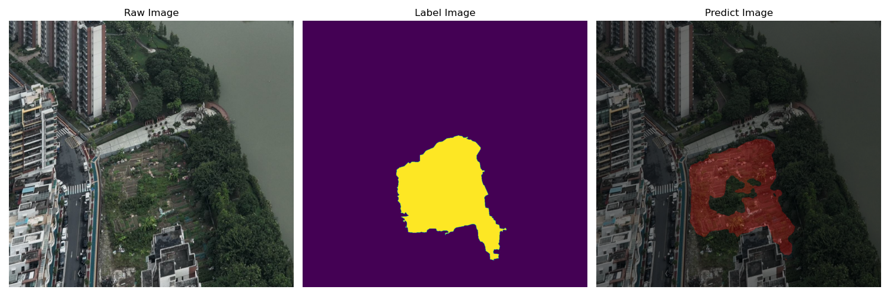
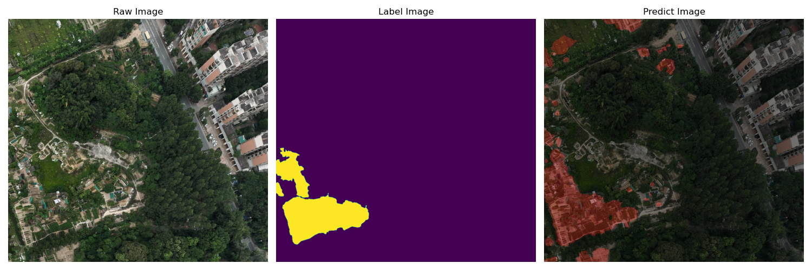
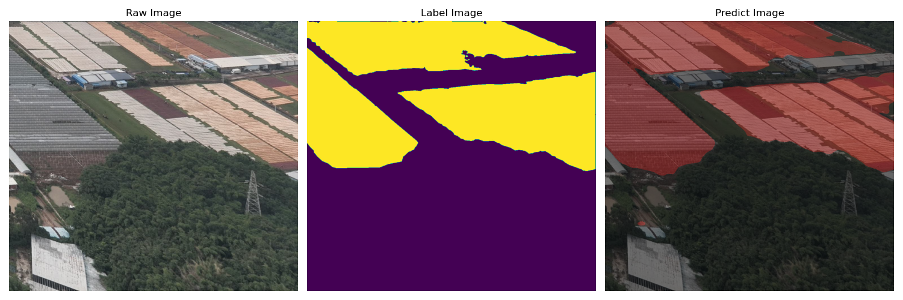

<h1>基于Unet网络的无人机全景图的耕地提取模型</h1>
Unet模型适合特征少，需要浅层特征的全景农田数据集

针对RGB的高明区无人机全景图的浅层特征数据集，利用Unet模型架构的优势提取影像的耕地目标，解决了复杂场景下的目标提取。

<h3>权重文件下载</h3>

训练所需的权值可在百度网盘中下载，下载后放到model。

链接: https://pan.baidu.com/s/1A22fC5cPRb74gqrpq7O9-A

提取码: 6n2c

<h2>主要步骤</h2>
1. 将存放全景图像的panorama文件夹下所有全景图切割并提取主要绿地作为农田图像；

2. 训练前将图片文件放在Datasets文件夹下的JPEGImages中;
   
3. 训练前将标签文件放在Datasets文件夹下的SegmentationClass中;
   
4. 在训练前利用annotation.py文件生成对应的txt;
   
5. 修改train.py的num\_classes为分类个数+1，这里只有农田类别，因此该参数设置为1;
   
6. 运行train.py即可开始训练；
    
7. 修改unet.py中的model\_path和num\_classes，打开predicet.py根据测试模型更改参数，进行预测测试

<h3>参考资料</h3>

https://github.com/bubbliiiing/unet-pytorch

https://arxiv.org/abs/1505.04597

